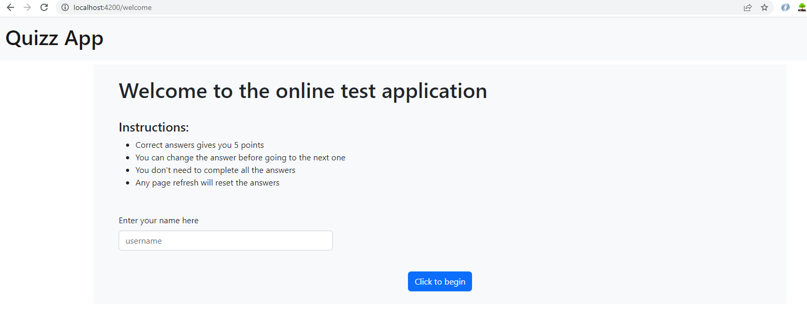
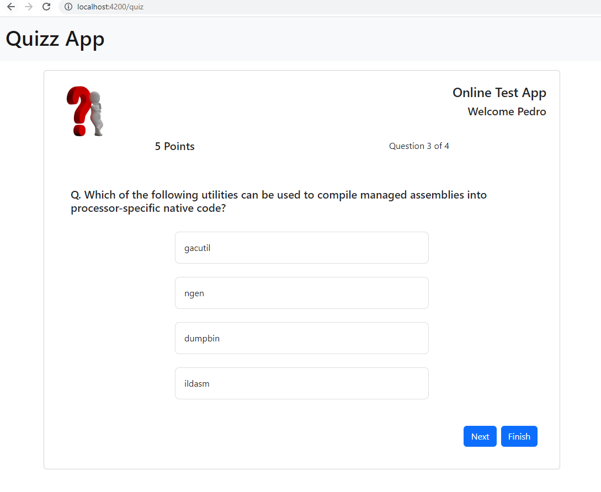
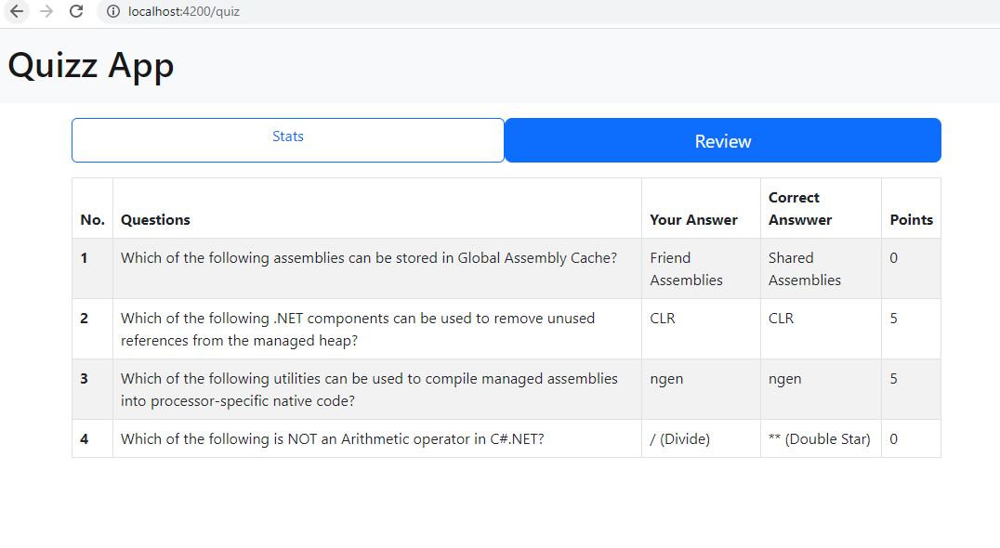

# Online Test Application

This system contains three main modules: Quiz, Review, and Result. The quiz section of the online test application accepts the questions in JSON format. The JSON file can be easily shared from the server in the pre-defined format. The application renders the test at the client-side.
The “Review and display result” section allows users to declare the results immediately

## Screenshots

- Welcome Screen

- Questions Screen

- Stats Screen

- Review Screen

## Development server

Run `ng serve` for a dev server. Navigate to `http://localhost:4200/`. The application will automatically reload if you change any of the source files.

## Build

Run `ng build` to build the project. The build artifacts will be stored in the `dist/` directory.

## Technologies Used

- Angular 15
- Bootstrap 5

## Spring Planning

- Welcome Screen
  - The user gets a welcome screen where he can input his/her name 
    - Create welcome component
    - style component container
    - Use local storage to save username on input
    - navigate to quiz component after input user name
- Quiz screen
  - The user user is able to respond one question per screen, selecting one option
  - The Administrator can dynamically put the questions in the app, following a defined structure
    - Create model for questions and respective options
    - Create file in assets to store the questions
  - The user gets the questions loaded from a json file
    - create service to load questions from assets
  - The user can see current number of points, current question number, his name in the title
- Result Screen
  - When user finish game, he is able to see the following stats of his/her game:
    message with result, total number of questions, correct answers, score
    - Create result component
    - Use ngif directive to show stats screen when user press button
    - style stats screen
  - The user is able to see all the questions with his/her answers, the correct answers and number of points
    - create table with the required headers
    - iterate the question and show to the user
    - Create pipes for show selected answer, correct answers and number of points
    - style review table
- Documentation
  - Take screenshots of App
  - Write Documentation

